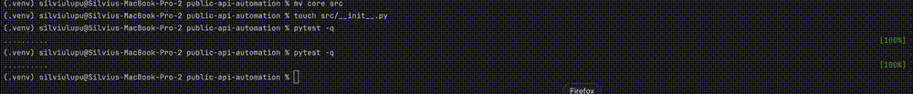

# API Automation Framework (Pytest + Requests)

## Overview

This project contains an automated API test framework written in Python using:

- *Pytest* as the test runner
- *Requests* for HTTP communication
- Parametrized tests for scalable coverage

The API under test is *JSONPlaceholder*:
https://jsonplaceholder.typicode.com

JSONPlaceholder is a stable public REST API suitable for automation exercises.

---

## Framework POM

The project follows the following structure:

public-api-automation/
    - src
    - init.py
    - api_client

    - tests
    - init.py
    - test_public_api.py

    - pytest.ini
    - requirements.txt
    - READE.md 

## Installation

python -m venv .venv
source .venv/bin/activate
pip install -r requirements.txt

running tests - pytest -q

Python 3.9+ (required)
Pytest
Requests

## Test cases:
1. test name: Get posts returns 200
   - GET /posts
   - Status code validation
2. test name: Get posts returns non-empty list
   - GET /posts
   - Response type
3. test name: Get post by ID returns correct object
    - GET /posts/{id}
    - Data integrity validation
4. test name: Comments filtered by postId
   - GET /comments?postId={id}
   - Data consistency validation

## Demo Gif

